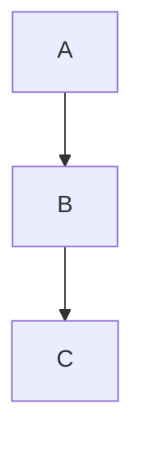

# GithubMarkdown Vencord Plugin — Implementation Plan

> **For agentic workers:** REQUIRED SUB-SKILL: Use superpowers:subagent-driven-development (recommended) or superpowers:executing-plans to implement this plan task-by-task. Steps use checkbox (`- [ ]`) syntax for tracking.

**Goal:** Build a Vencord userplugin that renders Discord chat messages and attached `.md` files with full GitHub-Flavored Markdown parity, matching github.com rendering semantics and style, with a Raw/Rendered toggle for attached files.

**Architecture:** Dev happens in a standalone working directory (`c:\Projects\StoneyEagle\vencord-markdown-render\`). Plugin lives in a `githubMarkdown.desktop/` folder that the user drops into their Vencord fork's `src/userplugins/`. The plugin wraps Discord's `Parser.parse` at runtime (no brittle esbuild patches) for inline GFM features, and uses `MessageAccessoriesAPI` to render attached `.md` files inline with a Raw/Rendered toggle. The rendering pipeline uses unified + remark-gfm + rehype-sanitize with GitHub's schema. TDD targets the pure pipeline and feature-detect modules; React components and patches are wired up after and validated via manual QA against `fixtures.md`.

**Tech Stack:** TypeScript, React (Vencord provides), unified/remark/rehype, Shiki (reuse from `ShikiCodeblocks` if present), KaTeX, Mermaid, DOMPurify (via `rehype-sanitize`), vitest for tests.

**Spec:** [`docs/superpowers/specs/2026-04-17-github-markdown-vencord-plugin-design.md`](../specs/2026-04-17-github-markdown-vencord-plugin-design.md)

---

## Task 1: Scaffold plugin directory and tooling

**Files:**
- Create: `githubMarkdown.desktop/package.json`
- Create: `githubMarkdown.desktop/tsconfig.json`
- Create: `githubMarkdown.desktop/vitest.config.ts`
- Create: `githubMarkdown.desktop/.gitignore`
- Create: `githubMarkdown.desktop/README.md` (placeholder — real content in Task 14)

- [ ] **Step 1: Create plugin folder**

```bash
mkdir -p githubMarkdown.desktop/{renderer,components,patches,styles,tests}
```

- [ ] **Step 2: Write `package.json`**

```json
{
  "name": "vencord-github-markdown",
  "version": "0.1.0",
  "private": true,
  "type": "module",
  "scripts": {
    "test": "vitest run",
    "test:watch": "vitest"
  },
  "devDependencies": {
    "@testing-library/react": "^16.1.0",
    "@types/react": "^18.3.12",
    "@vitest/ui": "^2.1.8",
    "jsdom": "^25.0.1",
    "typescript": "^5.6.3",
    "vitest": "^2.1.8"
  },
  "dependencies": {
    "unified": "^11.0.5",
    "remark-parse": "^11.0.0",
    "remark-gfm": "^4.0.0",
    "remark-github-alerts": "^0.0.8",
    "remark-math": "^6.0.0",
    "remark-mermaidjs": "^7.0.0",
    "remark-rehype": "^11.1.1",
    "rehype-raw": "^7.0.0",
    "rehype-sanitize": "^6.0.0",
    "rehype-katex": "^7.0.1",
    "rehype-slug": "^6.0.0",
    "rehype-autolink-headings": "^7.1.0",
    "rehype-highlight": "^7.0.1",
    "hast-util-to-jsx-runtime": "^2.3.2",
    "hast-util-sanitize": "^5.0.2",
    "katex": "^0.16.11",
    "mermaid": "^11.4.1",
    "shiki": "^1.24.0"
  }
}
```

- [ ] **Step 3: Write `tsconfig.json`**

```json
{
  "compilerOptions": {
    "target": "ES2022",
    "module": "ESNext",
    "moduleResolution": "Bundler",
    "lib": ["ES2022", "DOM"],
    "jsx": "react-jsx",
    "strict": true,
    "esModuleInterop": true,
    "skipLibCheck": true,
    "resolveJsonModule": true,
    "allowSyntheticDefaultImports": true,
    "types": ["vitest/globals"],
    "paths": {
      "@webpack/*": ["../node_modules/vencord/dist/webpack/*"],
      "@utils/*": ["../node_modules/vencord/dist/utils/*"],
      "@api/*": ["../node_modules/vencord/dist/api/*"]
    }
  },
  "include": ["**/*.ts", "**/*.tsx"]
}
```

- [ ] **Step 4: Write `vitest.config.ts`**

```ts
import { defineConfig } from "vitest/config";

export default defineConfig({
  test: {
    globals: true,
    environment: "jsdom",
    include: ["tests/**/*.test.ts", "tests/**/*.test.tsx"],
  },
});
```

- [ ] **Step 5: Write `.gitignore`**

```
node_modules/
dist/
*.log
.DS_Store
```

- [ ] **Step 6: Write placeholder `README.md`**

```markdown
# GithubMarkdown

Vencord userplugin rendering Discord messages and `.md` attachments with GitHub-flavored markdown.

(Install + usage docs filled in at end of implementation.)
```

- [ ] **Step 7: Install dependencies**

```bash
cd githubMarkdown.desktop && pnpm install
```
Expected: lockfile created, no errors.

- [ ] **Step 8: Verify vitest runs (no tests yet)**

```bash
pnpm test
```
Expected: `No test files found` — not an error, just confirms wiring.

- [ ] **Step 9: Commit**

```bash
git init
git add githubMarkdown.desktop/
git commit -m "scaffold githubMarkdown plugin directory"
```

---

## Task 2: Feature-detection module (TDD)

Detect whether a message contains any GFM feature that Discord's built-in parser doesn't handle. Cheap regex pre-check; keeps overhead at zero for plain messages.

**Files:**
- Create: `githubMarkdown.desktop/renderer/featureDetect.ts`
- Test: `githubMarkdown.desktop/tests/feature-detect.test.ts`

- [ ] **Step 1: Write failing test**

`tests/feature-detect.test.ts`:
```ts
import { describe, it, expect } from "vitest";
import { hasGfmFeature } from "../renderer/featureDetect";

describe("hasGfmFeature", () => {
  it("returns false for plain text", () => {
    expect(hasGfmFeature("hello world")).toBe(false);
  });

  it("returns false for single pipe character", () => {
    expect(hasGfmFeature("use a | to separate")).toBe(false);
  });

  it("detects a GFM table", () => {
    expect(hasGfmFeature("| a | b |\n| - | - |\n| 1 | 2 |")).toBe(true);
  });

  it("detects a task list", () => {
    expect(hasGfmFeature("- [ ] todo\n- [x] done")).toBe(true);
  });

  it("detects a NOTE alert", () => {
    expect(hasGfmFeature("> [!NOTE]\n> hi")).toBe(true);
  });

  it("detects all alert kinds", () => {
    for (const k of ["NOTE", "TIP", "WARNING", "CAUTION", "IMPORTANT"]) {
      expect(hasGfmFeature(`> [!${k}]\n> x`)).toBe(true);
    }
  });

  it("detects block math", () => {
    expect(hasGfmFeature("$$\nx=1\n$$")).toBe(true);
  });

  it("detects mermaid fence", () => {
    expect(hasGfmFeature("```mermaid\ngraph TD\nA-->B\n```")).toBe(true);
  });

  it("detects footnote reference", () => {
    expect(hasGfmFeature("see [^1]\n\n[^1]: note")).toBe(true);
  });

  it("ignores standard fenced code block", () => {
    expect(hasGfmFeature("```js\nconst x = 1\n```")).toBe(false);
  });
});
```

- [ ] **Step 2: Run test to verify it fails**

```bash
pnpm test
```
Expected: FAIL — `Cannot find module '../renderer/featureDetect'`.

- [ ] **Step 3: Implement `featureDetect.ts`**

```ts
const PATTERNS: RegExp[] = [
  /^\s*\|.*\|.*\n\s*\|[\s\-:|]+\|/m,                  // table
  /^- \[[ xX]\] /m,                                     // task list
  /^> \[!(NOTE|TIP|WARNING|CAUTION|IMPORTANT)\]/mi,     // alert
  /^\$\$/m,                                             // block math
  /^```mermaid/m,                                       // mermaid
  /\[\^[\w-]+\]/,                                       // footnote ref
];

export function hasGfmFeature(content: string): boolean {
  for (const re of PATTERNS) if (re.test(content)) return true;
  return false;
}
```

- [ ] **Step 4: Run test to verify pass**

```bash
pnpm test
```
Expected: all 10 tests pass.

- [ ] **Step 5: Commit**

```bash
git add githubMarkdown.desktop/renderer/featureDetect.ts githubMarkdown.desktop/tests/feature-detect.test.ts
git commit -m "add GFM feature detection"
```

---

## Task 3: Sanitizer schema (TDD)

Sanitize HAST output using GitHub's allowlist. Strips `<script>`, inline event handlers, `javascript:` URLs, but keeps tables, task-list inputs, and headings.

**Files:**
- Create: `githubMarkdown.desktop/renderer/sanitize.ts`
- Test: `githubMarkdown.desktop/tests/sanitize.test.ts`

- [ ] **Step 1: Write failing test**

`tests/sanitize.test.ts`:
```ts
import { describe, it, expect } from "vitest";
import { unified } from "unified";
import remarkParse from "remark-parse";
import remarkGfm from "remark-gfm";
import remarkRehype from "remark-rehype";
import rehypeRaw from "rehype-raw";
import rehypeSanitize from "rehype-sanitize";
import rehypeStringify from "rehype-stringify";
import { githubSanitizeSchema } from "../renderer/sanitize";

async function run(md: string): Promise<string> {
  const file = await unified()
    .use(remarkParse)
    .use(remarkGfm)
    .use(remarkRehype, { allowDangerousHtml: true })
    .use(rehypeRaw)
    .use(rehypeSanitize, githubSanitizeSchema)
    .use(rehypeStringify)
    .process(md);
  return String(file);
}

describe("githubSanitizeSchema", () => {
  it("strips <script> tags", async () => {
    const out = await run("hi <script>alert(1)</script>");
    expect(out).not.toContain("<script");
  });

  it("strips inline event handlers", async () => {
    const out = await run('<a href="#" onclick="x()">hi</a>');
    expect(out).not.toContain("onclick");
  });

  it("strips javascript: URLs", async () => {
    const out = await run('[x](javascript:alert(1))');
    expect(out).not.toMatch(/href="javascript:/i);
  });

  it("keeps task list checkboxes", async () => {
    const out = await run("- [x] done");
    expect(out).toContain('type="checkbox"');
    expect(out).toContain("checked");
  });

  it("keeps table structure", async () => {
    const out = await run("| a | b |\n|---|---|\n| 1 | 2 |");
    expect(out).toContain("<table>");
    expect(out).toContain("<th>");
  });

  it("keeps heading id attributes (for anchors)", async () => {
    const out = await run('<h2 id="foo">Foo</h2>');
    expect(out).toContain('id="foo"');
  });
});
```

- [ ] **Step 2: Run test, verify fail**

```bash
pnpm test tests/sanitize.test.ts
```
Expected: FAIL — module not found.

- [ ] **Step 3: Install rehype-stringify**

```bash
pnpm add -D rehype-stringify
```

- [ ] **Step 4: Implement `sanitize.ts`**

```ts
import { defaultSchema } from "rehype-sanitize";
import type { Schema } from "hast-util-sanitize";

// Extends rehype-sanitize default (GitHub-aligned) with GFM + heading-id support.
export const githubSanitizeSchema: Schema = {
  ...defaultSchema,
  attributes: {
    ...defaultSchema.attributes,
    // Allow id on headings for autolinked anchors
    h1: [...(defaultSchema.attributes?.h1 ?? []), "id"],
    h2: [...(defaultSchema.attributes?.h2 ?? []), "id"],
    h3: [...(defaultSchema.attributes?.h3 ?? []), "id"],
    h4: [...(defaultSchema.attributes?.h4 ?? []), "id"],
    h5: [...(defaultSchema.attributes?.h5 ?? []), "id"],
    h6: [...(defaultSchema.attributes?.h6 ?? []), "id"],
    // Allow task-list checkbox input
    input: [
      ...(defaultSchema.attributes?.input ?? []),
      ["type", "checkbox"],
      "checked",
      "disabled",
    ],
    // Allow class on code blocks for highlight.js/shiki output
    code: [...(defaultSchema.attributes?.code ?? []), ["className", /^language-./, /^hljs/, /^shiki/]],
    span: [...(defaultSchema.attributes?.span ?? []), ["className", /^hljs-/, /^katex/, /^shiki/]],
    div: [...(defaultSchema.attributes?.div ?? []), ["className", /^markdown-alert/, /^mermaid/, /^katex/]],
    // Allow svg for mermaid
    svg: ["xmlns", "viewBox", "width", "height", "fill", "stroke", "class"],
  },
  tagNames: [
    ...(defaultSchema.tagNames ?? []),
    "input",
    "svg", "g", "path", "rect", "circle", "line", "polygon", "polyline", "text", "tspan", "defs", "marker",
    "math", "semantics", "mrow", "mi", "mn", "mo", "annotation",
  ],
  protocols: {
    ...defaultSchema.protocols,
    href: ["http", "https", "mailto", "tel", "discord"],
    src: ["http", "https", "data"],
  },
};
```

- [ ] **Step 5: Run test, verify pass**

```bash
pnpm test tests/sanitize.test.ts
```
Expected: all 6 tests pass.

- [ ] **Step 6: Commit**

```bash
git add githubMarkdown.desktop/renderer/sanitize.ts githubMarkdown.desktop/tests/sanitize.test.ts githubMarkdown.desktop/package.json
git commit -m "add GitHub-aligned sanitizer schema"
```

---

## Task 4: Rendering pipeline (TDD)

Core unified pipeline: markdown string → React node. Exposes `renderMarkdown(src, options) → ReactNode` used by both inline and attachment renderers.

**Files:**
- Create: `githubMarkdown.desktop/renderer/pipeline.ts`
- Test: `githubMarkdown.desktop/tests/pipeline.test.ts`

- [ ] **Step 1: Write failing test**

`tests/pipeline.test.ts`:
```ts
import { describe, it, expect } from "vitest";
import { renderToString } from "react-dom/server";
import { renderMarkdown } from "../renderer/pipeline";

async function render(md: string): Promise<string> {
  const node = await renderMarkdown(md, { enableMath: true, enableMermaid: false });
  return renderToString(node as any);
}

describe("renderMarkdown", () => {
  it("renders a table with GFM classes", async () => {
    const html = await render("| a | b |\n|---|---|\n| 1 | 2 |");
    expect(html).toContain("<table");
    expect(html).toContain("<th>a</th>");
  });

  it("renders task list with disabled checkboxes", async () => {
    const html = await render("- [x] done\n- [ ] todo");
    expect(html).toMatch(/<input[^>]+type="checkbox"[^>]+checked/);
    expect(html).toContain("disabled");
  });

  it("renders alert block with markdown-alert class", async () => {
    const html = await render("> [!NOTE]\n> important");
    expect(html).toMatch(/class="[^"]*markdown-alert[^"]*note/);
  });

  it("renders footnote reference and definition", async () => {
    const html = await render("see [^1]\n\n[^1]: note text");
    expect(html).toContain('href="#user-content-fn-1"');
    expect(html).toContain("note text");
  });

  it("renders inline math via katex", async () => {
    const html = await render("inline $x^2$ math");
    expect(html).toContain("katex");
  });

  it("renders heading with autolink anchor", async () => {
    const html = await render("## Hello World");
    expect(html).toMatch(/<h2[^>]+id="hello-world"/);
    expect(html).toContain('href="#hello-world"');
  });

  it("passes plain paragraph through", async () => {
    const html = await render("just words");
    expect(html).toContain("<p>just words</p>");
  });

  it("sanitizes dangerous HTML", async () => {
    const html = await render("");
    expect(html).not.toContain("onerror");
  });
});
```

- [ ] **Step 2: Install remaining deps**

```bash
pnpm add -D react react-dom @types/react-dom
```

- [ ] **Step 3: Run test, verify fail**

```bash
pnpm test tests/pipeline.test.ts
```
Expected: FAIL — module not found.

- [ ] **Step 4: Implement `pipeline.ts`**

```ts
import { unified } from "unified";
import remarkParse from "remark-parse";
import remarkGfm from "remark-gfm";
import remarkGithubAlerts from "remark-github-alerts";
import remarkMath from "remark-math";
import remarkRehype from "remark-rehype";
import rehypeRaw from "rehype-raw";
import rehypeSanitize from "rehype-sanitize";
import rehypeKatex from "rehype-katex";
import rehypeSlug from "rehype-slug";
import rehypeAutolinkHeadings from "rehype-autolink-headings";
import rehypeHighlight from "rehype-highlight";
import { toJsxRuntime } from "hast-util-to-jsx-runtime";
import { Fragment, jsx, jsxs } from "react/jsx-runtime";
import type { ReactNode } from "react";
import { githubSanitizeSchema } from "./sanitize";

export interface RenderOptions {
  enableMath: boolean;
  enableMermaid: boolean;
}

export async function renderMarkdown(
  source: string,
  opts: RenderOptions,
): Promise<ReactNode> {
  let processor = unified()
    .use(remarkParse)
    .use(remarkGfm)
    .use(remarkGithubAlerts);

  if (opts.enableMath) processor = processor.use(remarkMath);

  if (opts.enableMermaid) {
    // Mermaid plugin must run on mdast before remark-rehype.
    const { default: remarkMermaidjs } = await import("remark-mermaidjs");
    processor = processor.use(remarkMermaidjs);
  }

  processor = processor
    .use(remarkRehype, { allowDangerousHtml: true })
    .use(rehypeRaw)
    .use(rehypeSlug)
    .use(rehypeAutolinkHeadings, { behavior: "append" })
    .use(rehypeSanitize, githubSanitizeSchema)
    .use(rehypeHighlight, { detect: true, ignoreMissing: true });

  if (opts.enableMath) processor = processor.use(rehypeKatex);

  const tree = processor.parse(source);
  const hast = await processor.run(tree);

  return toJsxRuntime(hast as any, {
    Fragment,
    jsx: jsx as any,
    jsxs: jsxs as any,
  });
}
```

- [ ] **Step 5: Run test, verify pass**

```bash
pnpm test tests/pipeline.test.ts
```
Expected: all 8 tests pass. If `remark-github-alerts` outputs a different class pattern, update test expectation to match actual output (e.g. `class="markdown-alert markdown-alert-note"`).

- [ ] **Step 6: Commit**

```bash
git add githubMarkdown.desktop/renderer/pipeline.ts githubMarkdown.desktop/tests/pipeline.test.ts githubMarkdown.desktop/package.json
git commit -m "add unified markdown rendering pipeline"
```

---

## Task 5: `MarkdownView` React component

Wraps `renderMarkdown` with a React state lifecycle — async render is re-computed when `source` or options change. Provides consistent container class for styling.

**Files:**
- Create: `githubMarkdown.desktop/components/MarkdownView.tsx`
- Test: `githubMarkdown.desktop/tests/MarkdownView.test.tsx`

- [ ] **Step 1: Write failing test**

`tests/MarkdownView.test.tsx`:
```tsx
import { describe, it, expect } from "vitest";
import { render, waitFor } from "@testing-library/react";
import { MarkdownView } from "../components/MarkdownView";

describe("MarkdownView", () => {
  it("renders provided markdown", async () => {
    const { container } = render(
      <MarkdownView source="# Hello" enableMath={false} enableMermaid={false} />
    );
    await waitFor(() => {
      expect(container.querySelector("h1")).not.toBeNull();
    });
    expect(container.querySelector(".vc-ghmd-root")).not.toBeNull();
  });

  it("re-renders when source changes", async () => {
    const { container, rerender } = render(
      <MarkdownView source="# A" enableMath={false} enableMermaid={false} />
    );
    await waitFor(() => expect(container.textContent).toContain("A"));
    rerender(<MarkdownView source="# B" enableMath={false} enableMermaid={false} />);
    await waitFor(() => expect(container.textContent).toContain("B"));
  });

  it("shows error fallback when pipeline throws", async () => {
    // Pass a value that the pipeline cannot handle gracefully
    const { container } = render(
      <MarkdownView source={null as unknown as string} enableMath={false} enableMermaid={false} />
    );
    await waitFor(() => {
      expect(container.textContent).toMatch(/failed to render/i);
    });
  });
});
```

- [ ] **Step 2: Run test, verify fail**

```bash
pnpm test tests/MarkdownView.test.tsx
```
Expected: FAIL — module not found.

- [ ] **Step 3: Implement `MarkdownView.tsx`**

```tsx
import { useEffect, useState, type ReactNode } from "react";
import { renderMarkdown } from "../renderer/pipeline";

export interface MarkdownViewProps {
  source: string;
  enableMath: boolean;
  enableMermaid: boolean;
  className?: string;
}

export function MarkdownView({ source, enableMath, enableMermaid, className }: MarkdownViewProps) {
  const [node, setNode] = useState<ReactNode>(null);
  const [error, setError] = useState<string | null>(null);

  useEffect(() => {
    let cancelled = false;
    setError(null);
    (async () => {
      try {
        const rendered = await renderMarkdown(source, { enableMath, enableMermaid });
        if (!cancelled) setNode(rendered);
      } catch (e) {
        if (!cancelled) setError(e instanceof Error ? e.message : String(e));
      }
    })();
    return () => { cancelled = true; };
  }, [source, enableMath, enableMermaid]);

  if (error) {
    return (
      <div className="vc-ghmd-root vc-ghmd-error">
        <strong>Failed to render markdown:</strong> {error}
      </div>
    );
  }

  return <div className={`vc-ghmd-root ${className ?? ""}`}>{node}</div>;
}
```

- [ ] **Step 4: Run test, verify pass**

```bash
pnpm test tests/MarkdownView.test.tsx
```
Expected: 3 tests pass.

- [ ] **Step 5: Commit**

```bash
git add githubMarkdown.desktop/components/MarkdownView.tsx githubMarkdown.desktop/tests/MarkdownView.test.tsx
git commit -m "add MarkdownView React component"
```

---

## Task 6: `RawToggle` component

Toggle button mirroring GitHub's Code/Preview switch. Controlled component — parent holds the state.

**Files:**
- Create: `githubMarkdown.desktop/components/RawToggle.tsx`
- Test: `githubMarkdown.desktop/tests/RawToggle.test.tsx`

- [ ] **Step 1: Write failing test**

`tests/RawToggle.test.tsx`:
```tsx
import { describe, it, expect, vi } from "vitest";
import { render, fireEvent } from "@testing-library/react";
import { RawToggle } from "../components/RawToggle";

describe("RawToggle", () => {
  it("renders both mode buttons", () => {
    const { getByText } = render(<RawToggle mode="rendered" onChange={() => {}} />);
    expect(getByText("Rendered")).not.toBeNull();
    expect(getByText("Raw")).not.toBeNull();
  });

  it("calls onChange with 'raw' when Raw clicked", () => {
    const onChange = vi.fn();
    const { getByText } = render(<RawToggle mode="rendered" onChange={onChange} />);
    fireEvent.click(getByText("Raw"));
    expect(onChange).toHaveBeenCalledWith("raw");
  });

  it("marks current mode as active", () => {
    const { getByText } = render(<RawToggle mode="raw" onChange={() => {}} />);
    expect(getByText("Raw").className).toContain("vc-ghmd-toggle-active");
    expect(getByText("Rendered").className).not.toContain("vc-ghmd-toggle-active");
  });
});
```

- [ ] **Step 2: Run test, verify fail**

```bash
pnpm test tests/RawToggle.test.tsx
```
Expected: FAIL — module not found.

- [ ] **Step 3: Implement `RawToggle.tsx`**

```tsx
export type ViewMode = "rendered" | "raw";

export interface RawToggleProps {
  mode: ViewMode;
  onChange: (mode: ViewMode) => void;
}

export function RawToggle({ mode, onChange }: RawToggleProps) {
  const cls = (m: ViewMode) =>
    `vc-ghmd-toggle-btn${mode === m ? " vc-ghmd-toggle-active" : ""}`;
  return (
    <div className="vc-ghmd-toggle">
      <button className={cls("rendered")} onClick={() => onChange("rendered")}>Rendered</button>
      <button className={cls("raw")} onClick={() => onChange("raw")}>Raw</button>
    </div>
  );
}
```

- [ ] **Step 4: Run test, verify pass**

```bash
pnpm test tests/RawToggle.test.tsx
```
Expected: 3 tests pass.

- [ ] **Step 5: Commit**

```bash
git add githubMarkdown.desktop/components/RawToggle.tsx githubMarkdown.desktop/tests/RawToggle.test.tsx
git commit -m "add RawToggle component"
```

---

## Task 7: `MdAttachment` component

Renders one `.md` file attachment: fetches content, caches by attachment id, supports Raw/Rendered toggle.

**Files:**
- Create: `githubMarkdown.desktop/components/MdAttachment.tsx`
- Test: `githubMarkdown.desktop/tests/MdAttachment.test.tsx`

- [ ] **Step 1: Write failing test**

`tests/MdAttachment.test.tsx`:
```tsx
import { describe, it, expect, vi, beforeEach } from "vitest";
import { render, waitFor, fireEvent } from "@testing-library/react";
import { MdAttachment, clearMdCache } from "../components/MdAttachment";

const fakeAttachment = {
  id: "a1",
  filename: "doc.md",
  url: "https://example.test/doc.md",
  size: 20,
};

beforeEach(() => {
  clearMdCache();
  global.fetch = vi.fn(async () =>
    new Response("# hello", { status: 200 })
  ) as any;
});

describe("MdAttachment", () => {
  it("fetches and renders markdown", async () => {
    const { container } = render(
      <MdAttachment
        attachment={fakeAttachment as any}
        defaultMode="rendered"
        enableMath
        enableMermaid={false}
      />
    );
    await waitFor(() => expect(container.querySelector("h1")).not.toBeNull());
    expect((global.fetch as any)).toHaveBeenCalledWith(fakeAttachment.url);
  });

  it("toggles to raw view", async () => {
    const { container, findByText } = render(
      <MdAttachment
        attachment={fakeAttachment as any}
        defaultMode="rendered"
        enableMath
        enableMermaid={false}
      />
    );
    await waitFor(() => expect(container.querySelector("h1")).not.toBeNull());
    fireEvent.click(await findByText("Raw"));
    await waitFor(() => expect(container.querySelector("pre")).not.toBeNull());
    expect(container.textContent).toContain("# hello");
  });

  it("caches by attachment id — second render doesn't refetch", async () => {
    const { unmount } = render(
      <MdAttachment attachment={fakeAttachment as any} defaultMode="rendered" enableMath={false} enableMermaid={false} />
    );
    await waitFor(() => expect((global.fetch as any).mock.calls.length).toBe(1));
    unmount();
    render(
      <MdAttachment attachment={fakeAttachment as any} defaultMode="rendered" enableMath={false} enableMermaid={false} />
    );
    // still 1
    expect((global.fetch as any).mock.calls.length).toBe(1);
  });

  it("shows error banner when fetch fails", async () => {
    (global.fetch as any) = vi.fn(async () => new Response("", { status: 500 }));
    clearMdCache();
    const { container } = render(
      <MdAttachment attachment={fakeAttachment as any} defaultMode="rendered" enableMath={false} enableMermaid={false} />
    );
    await waitFor(() => expect(container.textContent).toMatch(/could not load/i));
  });
});
```

- [ ] **Step 2: Run test, verify fail**

```bash
pnpm test tests/MdAttachment.test.tsx
```
Expected: FAIL — module not found.

- [ ] **Step 3: Implement `MdAttachment.tsx`**

```tsx
import { useEffect, useState } from "react";
import { MarkdownView } from "./MarkdownView";
import { RawToggle, type ViewMode } from "./RawToggle";

export interface DiscordAttachment {
  id: string;
  filename: string;
  url: string;
  size: number;
}

export interface MdAttachmentProps {
  attachment: DiscordAttachment;
  defaultMode: ViewMode;
  enableMath: boolean;
  enableMermaid: boolean;
}

const cache = new Map<string, string>();
export function clearMdCache() { cache.clear(); }

export function MdAttachment({ attachment, defaultMode, enableMath, enableMermaid }: MdAttachmentProps) {
  const [source, setSource] = useState<string | null>(cache.get(attachment.id) ?? null);
  const [error, setError] = useState<string | null>(null);
  const [mode, setMode] = useState<ViewMode>(defaultMode);

  useEffect(() => {
    if (cache.has(attachment.id)) return;
    let cancelled = false;
    (async () => {
      try {
        const res = await fetch(attachment.url);
        if (!res.ok) throw new Error(`HTTP ${res.status}`);
        const text = await res.text();
        cache.set(attachment.id, text);
        if (!cancelled) setSource(text);
      } catch (e) {
        if (!cancelled) setError(e instanceof Error ? e.message : String(e));
      }
    })();
    return () => { cancelled = true; };
  }, [attachment.id, attachment.url]);

  if (error) return (
    <div className="vc-ghmd-attachment vc-ghmd-error">
      Could not load {attachment.filename}: {error}
    </div>
  );

  if (source == null) return (
    <div className="vc-ghmd-attachment vc-ghmd-loading">
      Loading {attachment.filename}…
    </div>
  );

  return (
    <div className="vc-ghmd-attachment">
      <div className="vc-ghmd-attachment-header">
        <span className="vc-ghmd-filename">{attachment.filename}</span>
        <RawToggle mode={mode} onChange={setMode} />
      </div>
      {mode === "rendered"
        ? <MarkdownView source={source} enableMath={enableMath} enableMermaid={enableMermaid} />
        : <pre className="vc-ghmd-raw"><code>{source}</code></pre>}
    </div>
  );
}
```

- [ ] **Step 4: Run test, verify pass**

```bash
pnpm test tests/MdAttachment.test.tsx
```
Expected: 4 tests pass.

- [ ] **Step 5: Commit**

```bash
git add githubMarkdown.desktop/components/MdAttachment.tsx githubMarkdown.desktop/tests/MdAttachment.test.tsx
git commit -m "add MdAttachment component with raw/rendered toggle and cache"
```

---

## Task 8: Parser monkey-patch module (TDD with mock Parser)

Wraps Discord's `Parser.parse` at runtime — delegates to our renderer only when feature-detection matches. `stop()` restores the original.

**Files:**
- Create: `githubMarkdown.desktop/patches/parser.ts`
- Test: `githubMarkdown.desktop/tests/parser-patch.test.ts`

- [ ] **Step 1: Write failing test**

`tests/parser-patch.test.ts`:
```ts
import { describe, it, expect, vi } from "vitest";
import { installParserPatch, uninstallParserPatch } from "../patches/parser";

interface MockParser { parse: (content: string, inline?: boolean, state?: any) => any; }

function makeParser(): MockParser {
  return { parse: vi.fn((c: string) => ({ type: "original", content: c })) };
}

describe("installParserPatch", () => {
  it("passes plain messages through to original parse", () => {
    const p = makeParser();
    installParserPatch(p as any, {
      render: () => "GFM",
      enableMath: false,
      enableMermaid: false,
    });
    const result = p.parse("just words");
    expect(result).toEqual({ type: "original", content: "just words" });
    uninstallParserPatch(p as any);
  });

  it("delegates when GFM feature detected", () => {
    const p = makeParser();
    installParserPatch(p as any, {
      render: (src) => ({ type: "gfm", src }),
      enableMath: false,
      enableMermaid: false,
    });
    const result = p.parse("- [ ] task");
    expect(result).toEqual({ type: "gfm", src: "- [ ] task" });
    uninstallParserPatch(p as any);
  });

  it("falls back to original if renderer throws", () => {
    const p = makeParser();
    installParserPatch(p as any, {
      render: () => { throw new Error("boom"); },
      enableMath: false,
      enableMermaid: false,
    });
    const result = p.parse("- [ ] task");
    expect(result).toEqual({ type: "original", content: "- [ ] task" });
    uninstallParserPatch(p as any);
  });

  it("uninstall restores original parse", () => {
    const p = makeParser();
    const original = p.parse;
    installParserPatch(p as any, {
      render: () => "GFM",
      enableMath: false,
      enableMermaid: false,
    });
    expect(p.parse).not.toBe(original);
    uninstallParserPatch(p as any);
    expect(p.parse).toBe(original);
  });
});
```

- [ ] **Step 2: Run test, verify fail**

```bash
pnpm test tests/parser-patch.test.ts
```
Expected: FAIL.

- [ ] **Step 3: Implement `parser.ts`**

```ts
import { hasGfmFeature } from "../renderer/featureDetect";

export interface ParserPatchOptions {
  render: (source: string, state: any) => unknown;
  enableMath: boolean;
  enableMermaid: boolean;
}

interface PatchTarget {
  parse: (content: string, inline?: boolean, state?: any) => unknown;
  __ghmdOriginalParse?: (content: string, inline?: boolean, state?: any) => unknown;
}

export function installParserPatch(target: PatchTarget, opts: ParserPatchOptions): void {
  if (target.__ghmdOriginalParse) return;
  const original = target.parse.bind(target);
  target.__ghmdOriginalParse = original;
  target.parse = (content: string, inline?: boolean, state?: any) => {
    try {
      if (typeof content === "string" && hasGfmFeature(content)) {
        return opts.render(content, state);
      }
    } catch (e) {
      console.error("[GithubMarkdown] render failed, falling back:", e);
    }
    return original(content, inline, state);
  };
}

export function uninstallParserPatch(target: PatchTarget): void {
  if (!target.__ghmdOriginalParse) return;
  target.parse = target.__ghmdOriginalParse;
  delete target.__ghmdOriginalParse;
}
```

- [ ] **Step 4: Run test, verify pass**

```bash
pnpm test tests/parser-patch.test.ts
```
Expected: 4 tests pass.

- [ ] **Step 5: Commit**

```bash
git add githubMarkdown.desktop/patches/parser.ts githubMarkdown.desktop/tests/parser-patch.test.ts
git commit -m "add Discord Parser monkey-patch with install/uninstall"
```

---

## Task 9: Inline message render adapter

Produces the React node that the patched `Parser.parse` returns when a GFM feature is detected. Needs to match the shape Discord's renderer expects — an array of React elements or a single element that React can render in the message content slot.

**Files:**
- Create: `githubMarkdown.desktop/renderer/inlineRender.ts`
- Test: `githubMarkdown.desktop/tests/inlineRender.test.tsx`

- [ ] **Step 1: Write failing test**

`tests/inlineRender.test.tsx`:
```tsx
import { describe, it, expect } from "vitest";
import { render, waitFor } from "@testing-library/react";
import { makeInlineRenderer } from "../renderer/inlineRender";

describe("makeInlineRenderer", () => {
  it("returns an array containing a single React element", () => {
    const renderer = makeInlineRenderer({ enableMath: false, enableMermaid: false });
    const result = renderer("- [ ] do thing", {});
    expect(Array.isArray(result)).toBe(true);
    expect(result.length).toBe(1);
  });

  it("the element renders GFM content into the DOM", async () => {
    const renderer = makeInlineRenderer({ enableMath: false, enableMermaid: false });
    const [element] = renderer("- [ ] do thing", {});
    const { container } = render(element);
    await waitFor(() => {
      expect(container.querySelector('input[type="checkbox"]')).not.toBeNull();
    });
  });
});
```

- [ ] **Step 2: Run test, verify fail**

```bash
pnpm test tests/inlineRender.test.tsx
```
Expected: FAIL.

- [ ] **Step 3: Implement `inlineRender.ts`**

```tsx
import type { ReactElement } from "react";
import { MarkdownView } from "../components/MarkdownView";

export interface InlineRendererOptions {
  enableMath: boolean;
  enableMermaid: boolean;
}

export function makeInlineRenderer(opts: InlineRendererOptions) {
  return (source: string, _state: unknown): ReactElement[] => {
    return [
      <MarkdownView
        key="vc-ghmd-inline"
        source={source}
        enableMath={opts.enableMath}
        enableMermaid={opts.enableMermaid}
        className="vc-ghmd-inline"
      />,
    ];
  };
}
```

(File must be `.tsx` — update the Create path above accordingly.)

- [ ] **Step 4: Run test, verify pass**

```bash
pnpm test tests/inlineRender.test.tsx
```
Expected: 2 tests pass.

- [ ] **Step 5: Commit**

```bash
git add githubMarkdown.desktop/renderer/inlineRender.tsx githubMarkdown.desktop/tests/inlineRender.test.tsx
git commit -m "add inline render adapter for patched Parser"
```

---

## Task 10: Settings definition

**Files:**
- Create: `githubMarkdown.desktop/settings.ts`

- [ ] **Step 1: Implement `settings.ts`**

```ts
import { definePluginSettings } from "@api/Settings";
import { OptionType } from "@utils/types";

export const settings = definePluginSettings({
  enableInlineGfm: {
    type: OptionType.BOOLEAN,
    description: "Render GFM features (tables, task lists, alerts, math, mermaid) in chat messages.",
    default: true,
  },
  enableMdAttachments: {
    type: OptionType.BOOLEAN,
    description: "Render .md file attachments inline with a Raw/Rendered toggle.",
    default: true,
  },
  defaultView: {
    type: OptionType.SELECT,
    description: "Default view mode for .md attachments.",
    options: [
      { label: "Rendered", value: "rendered", default: true },
      { label: "Raw", value: "raw" },
    ],
  },
  enableMath: {
    type: OptionType.BOOLEAN,
    description: "Render LaTeX math via KaTeX.",
    default: true,
  },
  enableMermaid: {
    type: OptionType.BOOLEAN,
    description: "Render mermaid code fences as diagrams.",
    default: true,
  },
  followDiscordTheme: {
    type: OptionType.BOOLEAN,
    description: "Automatically match Discord's light/dark theme.",
    default: true,
  },
});
```

- [ ] **Step 2: Type-check**

```bash
pnpm exec tsc --noEmit
```
Expected: no errors (imports resolve via tsconfig paths — if they don't, that's expected when developing outside a Vencord fork; paths are stubs. A matching `types.d.ts` stub is added in Task 12).

- [ ] **Step 3: Commit**

```bash
git add githubMarkdown.desktop/settings.ts
git commit -m "add plugin settings"
```

---

## Task 11: `MdAttachmentAccessory` wrapper

Reads props given by `MessageAccessoriesAPI`, filters `.md` attachments, renders each via `MdAttachment`. Honors settings.

**Files:**
- Create: `githubMarkdown.desktop/patches/attachment.tsx`

- [ ] **Step 1: Implement `attachment.tsx`**

```tsx
import { MdAttachment, type DiscordAttachment } from "../components/MdAttachment";
import { settings } from "../settings";

interface AccessoryProps {
  message: {
    attachments?: DiscordAttachment[];
  };
}

const MD_RE = /\.(md|markdown)$/i;

export function MdAttachmentAccessory({ message }: AccessoryProps) {
  if (!settings.store.enableMdAttachments) return null;
  const atts = message.attachments?.filter(a => MD_RE.test(a.filename)) ?? [];
  if (atts.length === 0) return null;

  return (
    <>
      {atts.map(a => (
        <MdAttachment
          key={a.id}
          attachment={a}
          defaultMode={settings.store.defaultView as "rendered" | "raw"}
          enableMath={settings.store.enableMath}
          enableMermaid={settings.store.enableMermaid}
        />
      ))}
    </>
  );
}
```

- [ ] **Step 2: Commit**

```bash
git add githubMarkdown.desktop/patches/attachment.tsx
git commit -m "add .md attachment accessory wrapper"
```

---

## Task 12: Styles

Two stylesheets. `github.css` = GitHub visual tokens mapped to Discord CSS vars. `plugin.css` = `.vc-ghmd-*` structural classes for toggles, error states, attachment frame.

**Files:**
- Create: `githubMarkdown.desktop/styles/github.css`
- Create: `githubMarkdown.desktop/styles/plugin.css`
- Create: `githubMarkdown.desktop/styles/index.css` (imports both)

- [ ] **Step 1: Write `github.css`**

```css
.vc-ghmd-root {
  --color-fg-default: var(--text-normal);
  --color-fg-muted: var(--text-muted);
  --color-canvas-default: transparent;
  --color-canvas-subtle: var(--background-secondary);
  --color-border-default: var(--background-modifier-accent);
  --color-border-muted: var(--background-modifier-hover);
  --color-accent-fg: var(--brand-500);
  --color-danger-fg: var(--status-danger);
  --color-attention-fg: var(--status-warning);

  color: var(--color-fg-default);
  line-height: 1.5;
  font-size: 1rem;
  word-wrap: break-word;
}

.vc-ghmd-root h1, .vc-ghmd-root h2 {
  padding-bottom: 0.3em;
  border-bottom: 1px solid var(--color-border-muted);
}

.vc-ghmd-root h1 { font-size: 2em; margin: 0.67em 0; }
.vc-ghmd-root h2 { font-size: 1.5em; margin: 0.75em 0; }
.vc-ghmd-root h3 { font-size: 1.25em; margin: 0.83em 0; }

.vc-ghmd-root table {
  border-collapse: collapse;
  margin: 1em 0;
  display: block;
  overflow-x: auto;
}
.vc-ghmd-root th, .vc-ghmd-root td {
  border: 1px solid var(--color-border-default);
  padding: 6px 13px;
}
.vc-ghmd-root tr:nth-child(even) {
  background: var(--color-canvas-subtle);
}

.vc-ghmd-root blockquote {
  color: var(--color-fg-muted);
  border-left: 0.25em solid var(--color-border-default);
  padding: 0 1em;
  margin: 1em 0;
}

.vc-ghmd-root code {
  background: var(--color-canvas-subtle);
  padding: 0.2em 0.4em;
  border-radius: 6px;
  font-family: var(--font-code, ui-monospace, monospace);
  font-size: 85%;
}

.vc-ghmd-root pre > code {
  display: block;
  padding: 16px;
  overflow-x: auto;
  background: var(--color-canvas-subtle);
  border-radius: 6px;
  font-size: 85%;
}

.vc-ghmd-root ul, .vc-ghmd-root ol { padding-left: 2em; margin: 1em 0; }
.vc-ghmd-root li { margin: 0.25em 0; }
.vc-ghmd-root li input[type="checkbox"] { margin-right: 0.5em; }

.vc-ghmd-root a { color: var(--color-accent-fg); text-decoration: none; }
.vc-ghmd-root a:hover { text-decoration: underline; }

.vc-ghmd-root .markdown-alert {
  padding: 0.5em 1em;
  margin: 1em 0;
  border-left: 0.25em solid;
  background: var(--color-canvas-subtle);
}
.vc-ghmd-root .markdown-alert-note { border-color: var(--color-accent-fg); }
.vc-ghmd-root .markdown-alert-tip { border-color: #1a7f37; }
.vc-ghmd-root .markdown-alert-warning { border-color: var(--color-attention-fg); }
.vc-ghmd-root .markdown-alert-caution { border-color: var(--color-danger-fg); }
.vc-ghmd-root .markdown-alert-important { border-color: #8250df; }

.vc-ghmd-root img { max-width: 100%; }
```

- [ ] **Step 2: Write `plugin.css`**

```css
.vc-ghmd-attachment {
  margin: 8px 0;
  border: 1px solid var(--background-modifier-accent);
  border-radius: 8px;
  overflow: hidden;
  background: var(--background-secondary);
}

.vc-ghmd-attachment-header {
  display: flex;
  justify-content: space-between;
  align-items: center;
  padding: 8px 12px;
  background: var(--background-tertiary);
  border-bottom: 1px solid var(--background-modifier-accent);
}

.vc-ghmd-filename {
  font-family: var(--font-code, ui-monospace, monospace);
  font-size: 0.9em;
  color: var(--text-muted);
}

.vc-ghmd-toggle {
  display: inline-flex;
  border: 1px solid var(--background-modifier-accent);
  border-radius: 6px;
  overflow: hidden;
}

.vc-ghmd-toggle-btn {
  background: transparent;
  border: 0;
  color: var(--text-normal);
  padding: 4px 10px;
  cursor: pointer;
  font-size: 0.85em;
}

.vc-ghmd-toggle-btn.vc-ghmd-toggle-active {
  background: var(--brand-500);
  color: white;
}

.vc-ghmd-attachment > .vc-ghmd-root,
.vc-ghmd-attachment > .vc-ghmd-raw {
  padding: 16px;
}

.vc-ghmd-raw {
  background: var(--background-tertiary);
  margin: 0;
  font-family: var(--font-code, ui-monospace, monospace);
  font-size: 0.85em;
  white-space: pre;
  overflow-x: auto;
}

.vc-ghmd-loading,
.vc-ghmd-error {
  padding: 12px;
  color: var(--text-muted);
  font-style: italic;
}

.vc-ghmd-error {
  color: var(--status-danger);
  font-style: normal;
}
```

- [ ] **Step 3: Write `index.css`**

```css
@import "./github.css";
@import "./plugin.css";
```

- [ ] **Step 4: Commit**

```bash
git add githubMarkdown.desktop/styles/
git commit -m "add GitHub-style and plugin stylesheets"
```

---

## Task 13: `index.tsx` — `definePlugin` wire-up

Central plugin entry: lifecycle wiring, patches, settings, accessory registration. Includes stub type declarations for Vencord API imports so the plugin builds standalone for tests.

**Files:**
- Create: `githubMarkdown.desktop/index.tsx`
- Create: `githubMarkdown.desktop/vencord.d.ts` (ambient stubs for standalone type-check; ignored inside Vencord tree)

- [ ] **Step 1: Write `vencord.d.ts`**

```ts
// Ambient stubs so the plugin type-checks outside a Vencord checkout.
// Inside the Vencord tree these are provided by real modules — our stubs
// are shadowed.
declare module "@utils/types" {
  export const enum OptionType { BOOLEAN, SELECT, STRING, NUMBER, BIGINT }
  export interface PluginAuthor { name: string; id: bigint; }
  export function definePlugin<T>(p: T): T;
  export type StartAt = "Init" | "WebpackReady" | "DOMContentLoaded";
}
declare module "@api/Settings" {
  export function definePluginSettings<T>(t: T): { store: Record<string, any> };
}
declare module "@api/MessageAccessories" {
  export function addMessageAccessory(name: string, fn: (props: any) => any, priority?: number): void;
  export function removeMessageAccessory(name: string): void;
}
declare module "@webpack/common" {
  export const Parser: {
    parse: (content: string, inline?: boolean, state?: any) => any;
    parseTopic: (content: string, inline?: boolean, state?: any) => any;
  };
}
```

- [ ] **Step 2: Write `index.tsx`**

```tsx
import { definePlugin } from "@utils/types";
import { Parser } from "@webpack/common";
import { addMessageAccessory, removeMessageAccessory } from "@api/MessageAccessories";
import { installParserPatch, uninstallParserPatch } from "./patches/parser";
import { makeInlineRenderer } from "./renderer/inlineRender";
import { MdAttachmentAccessory } from "./patches/attachment";
import { settings } from "./settings";
import "./styles/index.css";

export default definePlugin({
  name: "GithubMarkdown",
  description:
    "Renders Discord messages and attached .md files with full GitHub-flavored markdown (tables, task lists, alerts, math, mermaid) and a Raw/Rendered toggle.",
  authors: [{ name: "patrickstaarink", id: 0n }],
  dependencies: ["MessageAccessoriesAPI"],
  settings,
  startAt: "WebpackReady" as const,

  start() {
    if (settings.store.enableInlineGfm && Parser?.parse) {
      const render = makeInlineRenderer({
        enableMath: settings.store.enableMath,
        enableMermaid: settings.store.enableMermaid,
      });
      installParserPatch(Parser as any, {
        render: (src, state) => render(src, state),
        enableMath: settings.store.enableMath,
        enableMermaid: settings.store.enableMermaid,
      });
    } else if (settings.store.enableInlineGfm) {
      console.warn("[GithubMarkdown] Parser not found — inline GFM disabled.");
    }

    if (settings.store.enableMdAttachments) {
      addMessageAccessory("GithubMarkdown", MdAttachmentAccessory, 10);
    }
  },

  stop() {
    if (Parser) uninstallParserPatch(Parser as any);
    removeMessageAccessory("GithubMarkdown");
  },
});
```

- [ ] **Step 3: Type-check**

```bash
pnpm exec tsc --noEmit
```
Expected: no errors.

- [ ] **Step 4: Run full test suite**

```bash
pnpm test
```
Expected: all tests pass (features-detect: 10, sanitize: 6, pipeline: 8, MarkdownView: 3, RawToggle: 3, MdAttachment: 4, parser-patch: 4, inlineRender: 2 = 40 tests).

- [ ] **Step 5: Commit**

```bash
git add githubMarkdown.desktop/index.tsx githubMarkdown.desktop/vencord.d.ts
git commit -m "add definePlugin entry, lifecycle wiring"
```

---

## Task 14: QA fixtures + README

**Files:**
- Create: `githubMarkdown.desktop/tests/fixtures.md`
- Modify: `githubMarkdown.desktop/README.md`

- [ ] **Step 1: Write `fixtures.md`**

```markdown
# GithubMarkdown fixture

## Tables
| Feature | Supported |
|---------|-----------|
| tables  | ✅        |
| math    | ✅        |

## Task list
- [x] done
- [ ] todo
- [ ] another

## Strikethrough
~~gone~~

## Alerts
> [!NOTE]
> Useful info.

> [!TIP]
> A tip.

> [!WARNING]
> Careful.

> [!CAUTION]
> Negative consequences.

> [!IMPORTANT]
> Must know.

## Footnotes
Claim[^1].

[^1]: Source.

## Math
Inline: $E = mc^2$

Block:
$$
\int_0^1 x^2 dx = \frac{1}{3}
$$

## Mermaid


## Code
```ts
const greet = (n: string) => `hi, ${n}`;
```

## Autolink
https://github.com

## Raw HTML
<details>
<summary>expand</summary>
hidden content
</details>

## Heading anchors
### Jump me
```

- [ ] **Step 2: Rewrite `README.md`**

```markdown
# GithubMarkdown — Vencord Plugin

Renders Discord chat messages and attached `.md` files with full GitHub-Flavored Markdown parity — tables, task lists, strikethrough, footnotes, alerts (`> [!NOTE]`), math (KaTeX), and Mermaid diagrams — styled to match github.com. Attached `.md` files get a GitHub-style Raw/Rendered toggle.

## Install

1. Have a working Vencord dev checkout (https://docs.vencord.dev/installing/).
2. Copy (or symlink) this entire folder into `Vencord/src/userplugins/`:
   ```bash
   cp -r githubMarkdown.desktop /path/to/Vencord/src/userplugins/
   ```
3. From the Vencord root:
   ```bash
   pnpm i
   pnpm build
   pnpm inject
   ```
4. Restart Discord. Enable **GithubMarkdown** in Settings → Vencord → Plugins.

> Requires `MessageAccessoriesAPI` (enabled by default).

## Settings

| Setting | Default | Purpose |
|---|---|---|
| Enable inline GFM | on | Tables / task lists / alerts / math / mermaid inside chat messages |
| Enable .md attachments | on | Inline viewer for attached `.md` / `.markdown` files |
| Default view | Rendered | Initial mode for `.md` attachments |
| Enable math | on | KaTeX math rendering |
| Enable mermaid | on | Mermaid diagrams |
| Follow Discord theme | on | Auto light/dark match |

## Manual QA checklist

1. Enable plugin, restart.
2. Paste `tests/fixtures.md` content into a chat message — every feature renders.
3. Drag `tests/fixtures.md` as an attachment — appears as inline viewer with Raw/Rendered toggle; toggle works both ways.
4. Flip each setting off/on — behavior reflects change without restart (`enableInlineGfm` requires reload).
5. Switch Discord to light theme — rendering recolors correctly.
6. Disable plugin — chat messages revert to Discord default rendering; `.md` attachments show default Discord card only.

## Running the test suite

```bash
pnpm i
pnpm test
```

40 unit tests covering feature detection, sanitizer, pipeline, components, and patch install/uninstall.

## How it works

- **Inline messages:** runtime monkey-patches `Parser.parse` (from `@webpack/common`). A cheap regex pre-check skips the pipeline for plain messages, so plain text has zero overhead. GFM messages route through a unified/remark/rehype pipeline, sanitized against a GitHub-aligned schema.
- **Attachments:** registers a `MessageAccessoriesAPI` entry that detects `.md` / `.markdown` filenames, fetches content, renders with the same pipeline, and shows a Raw/Rendered toggle.
- **Cleanup:** `stop()` restores the original `Parser.parse` and removes the accessory — fully reversible.

## License

Same as Vencord (GPL-3.0).
```

- [ ] **Step 3: Commit**

```bash
git add githubMarkdown.desktop/tests/fixtures.md githubMarkdown.desktop/README.md
git commit -m "add QA fixtures and complete README"
```

---

## Task 15: Final verification

- [ ] **Step 1: Full test suite green**

```bash
cd githubMarkdown.desktop && pnpm test
```
Expected: all tests pass.

- [ ] **Step 2: Type check clean**

```bash
pnpm exec tsc --noEmit
```
Expected: no errors.

- [ ] **Step 3: Verify folder is portable**

```bash
ls githubMarkdown.desktop/
```
Expected: no absolute paths in source; folder can be copied as-is into `Vencord/src/userplugins/`.

- [ ] **Step 4: Manual smoke test inside Vencord**

Follow README install steps. Paste `fixtures.md` into a chat. Confirm every feature renders. Toggle settings. Disable plugin, confirm clean revert.

- [ ] **Step 5: Final commit**

```bash
git add -A
git commit -m "ready for Vencord integration" --allow-empty
```
