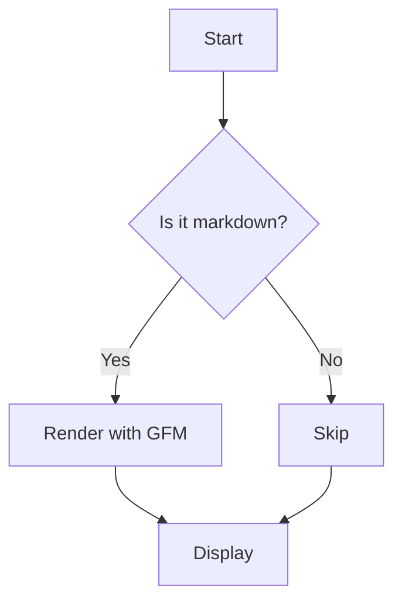

# GithubMarkdown QA fixtures

Paste each block into a Discord message (or attach as a `.md` file) to smoke-test the plugin. Each section exercises a distinct renderer capability.

## 1. Headings, paragraphs, and emphasis

```markdown
# Heading 1
## Heading 2
### Heading 3

Paragraph with **bold**, *italic*, ~~strikethrough~~, and `inline code`.

> Blockquote with *emphasis* and [a link](https://github.com).
```

## 2. Lists

```markdown
- Unordered item
- Another item
  - Nested item
  - Another nested
- Third

1. Ordered
2. Second
3. Third

- [ ] Task not done
- [x] Task done
- [ ] Another todo
```

## 3. Tables

```markdown
| Column A | Column B | Column C |
| -------- | :------: | -------: |
| left     |  center  |    right |
| `code`   | **bold** |   *em*   |
| row 3    |   ...    |    ...   |
```

## 4. Code blocks with highlighting

````markdown
```ts
interface User {
  id: number;
  name: string;
}

function greet(u: User): string {
  return `Hello, ${u.name}!`;
}
```

```python
def fib(n: int) -> int:
    if n < 2:
        return n
    return fib(n - 1) + fib(n - 2)
```

```rust
fn main() {
    let v: Vec<i32> = (1..=5).collect();
    println!("{:?}", v);
}
```
````

## 5. GitHub alerts

```markdown
> [!NOTE]
> Useful information that users should know, even when skimming content.

> [!TIP]
> Helpful advice for doing things better or more easily.

> [!IMPORTANT]
> Key information users need to know to achieve their goal.

> [!WARNING]
> Urgent info that needs immediate user attention to avoid problems.

> [!CAUTION]
> Advises about risks or negative outcomes of certain actions.
```

## 6. Math (requires `enableMath`)

```markdown
Inline math: $E = mc^2$ and $\int_0^\infty e^{-x^2} dx = \frac{\sqrt{\pi}}{2}$.

Block math:

$$
\sum_{n=1}^{\infty} \frac{1}{n^2} = \frac{\pi^2}{6}
$$
```

## 7. Mermaid (requires `enableMermaid`)

````markdown

````

## 8. Links, autolinks, images

```markdown
[Explicit link](https://example.com)

Autolink: https://github.com/Vendicated/Vencord


```

## 9. Footnotes

```markdown
Here is a statement[^1] with a footnote.

[^1]: This is the footnote body.
```

## 10. Heading anchors

```markdown
# My Section

Link back to [My Section](#user-content-my-section).
```

## 11. Raw HTML (must be sanitized)

```markdown
<p>Allowed paragraph.</p>

<script>alert("should be stripped")</script>


<a href="javascript:alert(1)">should lose href</a>
```

Expected: `<p>` renders, `<script>` is removed, dangerous `src`/`href`/`on*` attributes are stripped.

## 12. Mixed attachment

Attach a `.md` file containing a mix of the above to trigger the `MdAttachment` accessory. Verify the Raw / Rendered toggle swaps between the source text and rendered output, and that the choice persists when scrolling away and back.
